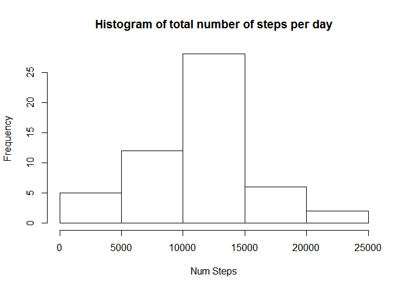
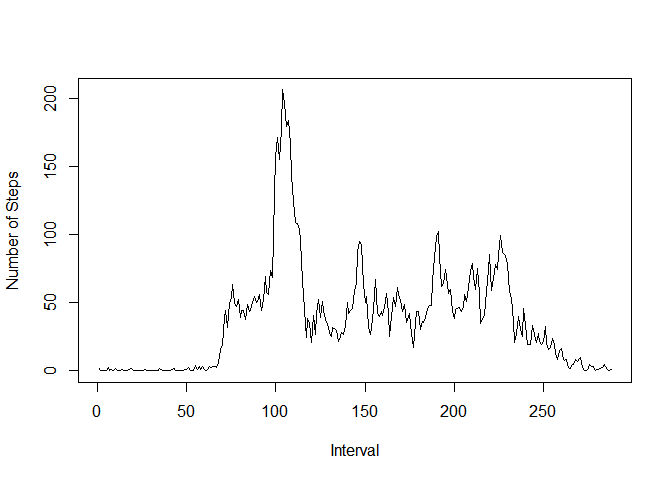
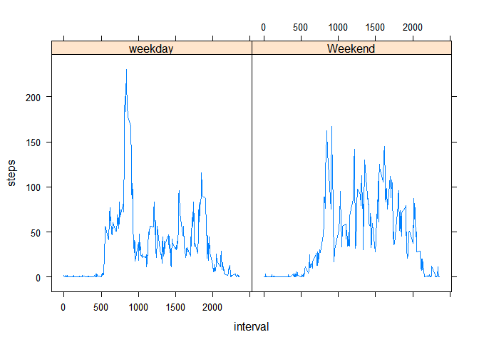

# Reproducible Research: Peer Assessment 1


## Loading and preprocessing the data


```r
# load the packages used
require(lubridate)
```

```
## Loading required package: lubridate
```

```
## 
## Attaching package: 'lubridate'
```

```
## The following object is masked from 'package:base':
## 
##     date
```

```r
require(data.table)
```

```
## Loading required package: data.table
```

```
## 
## Attaching package: 'data.table'
```

```
## The following objects are masked from 'package:lubridate':
## 
##     hour, isoweek, mday, minute, month, quarter, second, wday,
##     week, yday, year
```

```r
unzip("activity.zip")

data = read.csv("activity.csv")
data$date = ymd(data$date) # convert the date to a data class
```

## What is mean total number of steps taken per day?

What is the total number of steps per day, with the days:


```r
tapply(data$steps,data$date,sum, na.omit = TRUE)
```

```
## 2012-10-01 2012-10-02 2012-10-03 2012-10-04 2012-10-05 2012-10-06 
##         NA        127      11353      12117      13295      15421 
## 2012-10-07 2012-10-08 2012-10-09 2012-10-10 2012-10-11 2012-10-12 
##      11016         NA      12812       9901      10305      17383 
## 2012-10-13 2012-10-14 2012-10-15 2012-10-16 2012-10-17 2012-10-18 
##      12427      15099      10140      15085      13453      10057 
## 2012-10-19 2012-10-20 2012-10-21 2012-10-22 2012-10-23 2012-10-24 
##      11830      10396       8822      13461       8919       8356 
## 2012-10-25 2012-10-26 2012-10-27 2012-10-28 2012-10-29 2012-10-30 
##       2493       6779      10120      11459       5019       9820 
## 2012-10-31 2012-11-01 2012-11-02 2012-11-03 2012-11-04 2012-11-05 
##      15415         NA      10601      10572         NA      10440 
## 2012-11-06 2012-11-07 2012-11-08 2012-11-09 2012-11-10 2012-11-11 
##       8335      12884       3220         NA         NA      12609 
## 2012-11-12 2012-11-13 2012-11-14 2012-11-15 2012-11-16 2012-11-17 
##      10766       7337         NA         42       5442      14340 
## 2012-11-18 2012-11-19 2012-11-20 2012-11-21 2012-11-22 2012-11-23 
##      15111       8842       4473      12788      20428      21195 
## 2012-11-24 2012-11-25 2012-11-26 2012-11-27 2012-11-28 2012-11-29 
##      14479      11835      11163      13647      10184       7048 
## 2012-11-30 
##         NA
```


Plot a histogram of the number of steps (i.e. distribution)

```r
hist(tapply(data$steps,data$date,sum, na.omit = TRUE),xlab = "Num Steps", main = "Histogram of total number of steps per day")
```

<!-- -->

What is the mean number of steps per day?

```r
mean_steps = mean(tapply(data$steps,data$date,sum, na.rm = TRUE), na.rm = TRUE)
```

The mean number of steps per day is: 9354.2295082

what is the median number of steps per day?

```r
median_steps = median(tapply(data$steps,data$date,sum, na.rm = TRUE), na.rm = TRUE)
```

The median number of steps per day is: 10395

What is the average daily activity pattern?

```r
plot(tapply(data$steps, data$interval, mean, na.rm = TRUE), type = 'l', ylab = "Number of Steps", xlab = "Interval")
```

<!-- -->

Which 5-minute interval, on average across all the days in the dataset, contains the maximum number of steps?

The full interval with the maximum number of steps can be found using which.max as follows:

```r
data[which.max(data$steps),]
```

```
##       steps       date interval
## 16492   806 2012-11-27      615
```


## Imputing missing values

What is the total number of missing data?

```r
sum(!complete.cases(data))
```

```
## [1] 2304
```


Devise a strategy for filling in the missing values:
1. Create a mean data frame
2. Iterate through the existing data frame, replacing NA values with the mean values


```r
interval_steps <- aggregate(steps ~ interval, data, mean)
for (i in 1:nrow(data)){
  if (is.na(data$steps[i])){
    interval_val <- data$interval[i]
    row_id <- which(interval_steps$interval == interval_val)
    steps_val <- interval_steps$steps[row_id]
    data$steps[i] <- steps_val
  }
}
```

the impact of this is:

```r
new_median_steps = median(tapply(data$steps,data$date,sum, na.rm = TRUE), na.rm = TRUE)
new_mean_steps = mean(tapply(data$steps,data$date,sum, na.rm = TRUE), na.rm = TRUE)
```

The old mean: 9354.2295082  
The old median: 10395  

The new mean: 1.0766189\times 10^{4}  
the new median: 1.0766189\times 10^{4}  

## Are there differences in activity patterns between weekdays and weekends?

Create a new factor weekday vs weekend:


```r
day_of_week = 1:nrow(data)
data$day = wday(data$date)

 for (i in 1:nrow(data)){
  if (data[i,4] == 1 | data[i,4] == 7){
    day_of_week[i] = "Weekend"
  } else { day_of_week[i] = "weekday"}
}
data$day_of_week = day_of_week
data$day_of_week = factor(data$day_of_week)
stepsByDay <- aggregate(steps ~ interval + day_of_week, data = data, mean)
names(stepsByDay) <- c("interval", "day_of_week", "steps")

summary(stepsByDay)
```

```
##     interval       day_of_week      steps        
##  Min.   :   0.0   weekday:288   Min.   :  0.000  
##  1st Qu.: 588.8   Weekend:288   1st Qu.:  2.047  
##  Median :1177.5                 Median : 28.133  
##  Mean   :1177.5                 Mean   : 38.988  
##  3rd Qu.:1766.2                 3rd Qu.: 61.263  
##  Max.   :2355.0                 Max.   :230.378
```

```r
head(stepsByDay)
```

```
##   interval day_of_week      steps
## 1        0     weekday 2.25115304
## 2        5     weekday 0.44528302
## 3       10     weekday 0.17316562
## 4       15     weekday 0.19790356
## 5       20     weekday 0.09895178
## 6       25     weekday 1.59035639
```


Plot the data by weekend vs weekday:


```r
require(lattice)
```

```
## Loading required package: lattice
```

```r
xyplot(steps ~ interval | day_of_week, stepsByDay, type = "l")
```

<!-- -->
